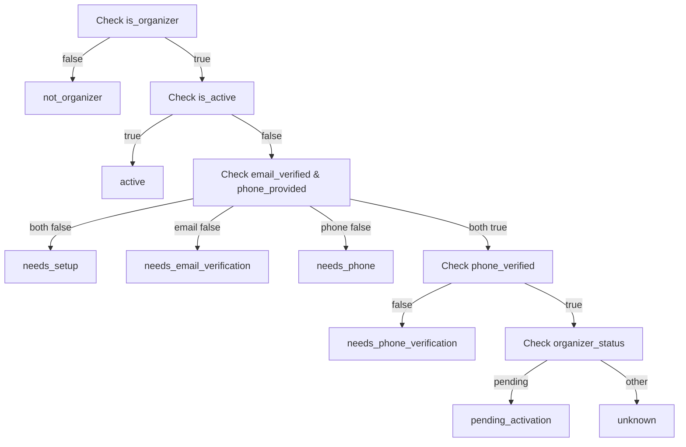

# Organizer Verification Status Flags Implementation

## Overview
This document describes the comprehensive organizer verification status system that provides detailed flags and activation status checking for organizers. This system gives clear visibility into verification requirements and activation status.

## Problem
Organizers needed a clear way to check their verification status and understand what steps are required to become fully activated. The existing system lacked detailed status flags and actionable guidance.

## Solution
Implemented dedicated organizer endpoints that provide:
- Detailed verification status flags
- Activation status checking
- Missing requirements identification
- Next action recommendations
- Quick status summaries

## New Organizer API Endpoints

### 1. Detailed Verification Status
**Endpoint**: `GET /api/organizers/verification-status`

**Purpose**: Get comprehensive verification status with all flags and details

**Response**:
```json
{
  "is_organizer": true,
  "email_verified": true,
  "phone_verified": true,
  "phone_provided": true,
  "email_verification_sent": false,
  "phone_verification_sent": false,
  "email_verification_expires_at": null,
  "phone_verification_expires_at": null,
  "organizer_status": "active",
  "is_active": true,
  "can_create_events": true,
  "missing_requirements": [],
  "next_actions": []
}
```

### 2. Quick Activation Check
**Endpoint**: `GET /api/organizers/activation-check`

**Purpose**: Fast check if organizer can create events

**Response**:
```json
{
  "is_organizer": true,
  "is_active": true,
  "can_create_events": true,
  "organizer_status": "active",
  "quick_status": "active"
}
```

### 3. Manual Activation Request
**Endpoint**: `POST /api/organizers/request-activation`

**Purpose**: Manually request organizer activation after verification

**Response**:
```json
{
  "message": "Organizer activated successfully! You can now create and manage events.",
  "status": "activated",
  "organizer_status": "active"
}
```

## Status Flags Explained

### Verification Flags
- **`is_organizer`**: User has organizer role assigned
- **`email_verified`**: Email verification completed successfully
- **`phone_verified`**: Phone verification completed successfully
- **`phone_provided`**: Phone number added to profile

### Status Tracking Flags
- **`email_verification_sent`**: Email verification code sent (not expired)
- **`phone_verification_sent`**: Phone verification code sent (not expired)
- **`email_verification_expires_at`**: Email token expiration time
- **`phone_verification_expires_at`**: Phone token expiration time

### Activation Flags
- **`organizer_status`**: Current organizer status (`pending`, `verified`, `active`, `suspended`)
- **`is_active`**: Fully verified and activated organizer
- **`can_create_events`**: Permission to create and manage events

### Guidance Flags
- **`missing_requirements`**: List of unmet verification requirements
- **`next_actions`**: Recommended next steps for activation

## Quick Status Values

### Status Types
```typescript
type QuickStatus = 
  | "not_organizer"           // User doesn't have organizer role
  | "active"                 // Fully verified and active
  | "needs_setup"            // Both email and phone need setup
  | "needs_email_verification" // Email verification required
  | "needs_phone"            // Phone number required
  | "needs_phone_verification" // Phone verification required
  | "pending_activation"     // Waiting for manual activation
  | "unknown"                // Undetermined status
```

### Status Logic Flow


## Frontend Integration

### React Hook Example
```typescript
const useOrganizerStatus = () => {
  const [status, setStatus] = useState(null);
  const [loading, setLoading] = useState(true);
  
  const fetchDetailedStatus = async () => {
    try {
      const detailedStatus = await apiClient.getOrganizerVerificationStatus();
      setStatus(detailedStatus);
    } catch (error) {
      console.error('Failed to fetch organizer status:', error);
    } finally {
      setLoading(false);
    }
  };
  
  const quickCheck = async () => {
    try {
      const quickStatus = await apiClient.checkOrganizerActivation();
      return quickStatus;
    } catch (error) {
      console.error('Failed to check activation:', error);
      return null;
    }
  };
  
  const requestActivation = async () => {
    try {
      const result = await apiClient.requestOrganizerActivation();
      await fetchDetailedStatus(); // Refresh status
      return result;
    } catch (error) {
      console.error('Failed to request activation:', error);
      throw error;
    }
  };
  
  useEffect(() => {
    fetchDetailedStatus();
  }, []);
  
  return { status, loading, quickCheck, requestActivation };
};
```

### Status Component Example
```typescript
const OrganizerStatusCard = () => {
  const { status, loading } = useOrganizerStatus();
  
  if (loading) return <div>Loading organizer status...</div>;
  
  if (!status?.is_organizer) {
    return (
      <div>
        <h3>Not an Organizer</h3>
        <p>Request organizer role to create events.</p>
        <button onClick={() => apiClient.addUserRole('organizer')}>
          Become Organizer
        </button>
      </div>
    );
  }
  
  return (
    <div>
      <h3>Organizer Status</h3>
      
      {/* Status Overview */}
      <div className={`status-badge ${status.is_active ? 'active' : 'pending'}`}>
        {status.is_active ? '✅ Active Organizer' : '⏳ Pending Activation'}
      </div>
      
      {/* Verification Status */}
      <div className="verification-status">
        <div className={`flag ${status.email_verified ? 'verified' : 'pending'}`}>
          Email: {status.email_verified ? '✅ Verified' : '❌ Not Verified'}
        </div>
        <div className={`flag ${status.phone_verified ? 'verified' : 'pending'}`}>
          Phone: {status.phone_verified ? '✅ Verified' : '❌ Not Verified'}
        </div>
      </div>
      
      {/* Missing Requirements */}
      {status.missing_requirements.length > 0 && (
        <div className="missing-requirements">
          <h4>Missing Requirements:</h4>
          <ul>
            {status.missing_requirements.map(req => (
              <li key={req}>{formatRequirement(req)}</li>
            ))}
          </ul>
        </div>
      )}
      
      {/* Next Actions */}
      {status.next_actions.length > 0 && (
        <div className="next-actions">
          <h4>Next Steps:</h4>
          {status.next_actions.map(action => (
            <button key={action} onClick={() => handleAction(action)}>
              {formatAction(action)}
            </button>
          ))}
        </div>
      )}
      
      {/* Activation Request */}
      {!status.is_active && status.missing_requirements.length === 0 && (
        <button onClick={requestActivation}>
          Request Organizer Activation
        </button>
      )}
      
      {/* Event Creation Permission */}
      <div className="permissions">
        <div className={`permission ${status.can_create_events ? 'granted' : 'denied'}`}>
          {status.can_create_events ? 
            '✅ Can create events' : 
            '❌ Cannot create events until activated'
          }
        </div>
      </div>
    </div>
  );
};
```

## API Response Examples

### Non-Organizer User
```json
{
  "is_organizer": false,
  "email_verified": false,
  "phone_verified": false,
  "phone_provided": false,
  "email_verification_sent": false,
  "phone_verification_sent": false,
  "email_verification_expires_at": null,
  "phone_verification_expires_at": null,
  "organizer_status": null,
  "is_active": false,
  "can_create_events": false,
  "missing_requirements": ["organizer_role"],
  "next_actions": ["Request organizer role"]
}
```

### Organizer - Setup Required
```json
{
  "is_organizer": true,
  "email_verified": false,
  "phone_verified": false,
  "phone_provided": false,
  "email_verification_sent": false,
  "phone_verification_sent": false,
  "email_verification_expires_at": null,
  "phone_verification_expires_at": null,
  "organizer_status": "pending",
  "is_active": false,
  "can_create_events": false,
  "missing_requirements": ["email_verification", "phone_number"],
  "next_actions": ["Send email verification", "Add phone number"]
}
```

### Organizer - Email Verification Sent
```json
{
  "is_organizer": true,
  "email_verified": false,
  "phone_verified": false,
  "phone_provided": true,
  "email_verification_sent": true,
  "phone_verification_sent": false,
  "email_verification_expires_at": "2023-01-02T12:00:00Z",
  "phone_verification_expires_at": null,
  "organizer_status": "pending",
  "is_active": false,
  "can_create_events": false,
  "missing_requirements": ["email_verification", "phone_verification"],
  "next_actions": ["Verify email code", "Send phone verification"]
}
```

### Organizer - Fully Active
```json
{
  "is_organizer": true,
  "email_verified": true,
  "phone_verified": true,
  "phone_provided": true,
  "email_verification_sent": false,
  "phone_verification_sent": false,
  "email_verification_expires_at": null,
  "phone_verification_expires_at": null,
  "organizer_status": "active",
  "is_active": true,
  "can_create_events": true,
  "missing_requirements": [],
  "next_actions": []
}
```

## Frontend Type Definitions

```typescript
interface OrganizerVerificationStatus {
  is_organizer: boolean;
  email_verified: boolean;
  phone_verified: boolean;
  phone_provided: boolean;
  email_verification_sent: boolean;
  phone_verification_sent: boolean;
  email_verification_expires_at?: string;
  phone_verification_expires_at?: string;
  organizer_status?: 'pending' | 'verified' | 'active' | 'suspended';
  is_active: boolean;
  can_create_events: boolean;
  missing_requirements: string[];
  next_actions: string[];
}

interface OrganizerActivationCheck {
  is_organizer: boolean;
  is_active: boolean;
  can_create_events: boolean;
  organizer_status?: 'pending' | 'verified' | 'active' | 'suspended';
  quick_status: QuickStatus;
}

type QuickStatus = 
  | 'not_organizer'
  | 'active'
  | 'needs_setup'
  | 'needs_email_verification'
  | 'needs_phone'
  | 'needs_phone_verification'
  | 'pending_activation'
  | 'unknown';
```

## Use Cases

### 1. Organizer Dashboard
```typescript
// Show organizer status with clear indicators
const OrganizerDashboard = () => {
  const { status } = useOrganizerStatus();
  
  if (!status?.can_create_events) {
    return <OrganizerOnboarding status={status} />;
  }
  
  return <EventManagement />;
};
```

### 2. Event Creation Permission Check
```typescript
// Check if user can create events before showing create button
const CreateEventButton = () => {
  const [canCreate, setCanCreate] = useState(false);
  
  useEffect(() => {
    const checkPermission = async () => {
      const check = await apiClient.checkOrganizerActivation();
      setCanCreate(check.can_create_events);
    };
    checkPermission();
  }, []);
  
  if (!canCreate) return null;
  
  return <button>Create Event</button>;
};
```

### 3. Verification Progress Tracker
```typescript
// Show progress through verification steps
const VerificationProgress = ({ status }: { status: OrganizerVerificationStatus }) => {
  const steps = [
    { key: 'email', label: 'Email Verification', completed: status.email_verified },
    { key: 'phone', label: 'Phone Setup', completed: status.phone_provided },
    { key: 'phone_verify', label: 'Phone Verification', completed: status.phone_verified },
    { key: 'activation', label: 'Activation', completed: status.is_active }
  ];
  
  return (
    <div className="progress-tracker">
      {steps.map((step, index) => (
        <div key={step.key} className={`step ${step.completed ? 'completed' : 'pending'}`}>
          <div className="step-number">{index + 1}</div>
          <div className="step-label">{step.label}</div>
          <div className="step-status">{step.completed ? '✅' : '⏳'}</div>
        </div>
      ))}
    </div>
  );
};
```

## Benefits

### 1. Clear Visibility
- **Status transparency**: Users know exactly where they stand
- **Actionable guidance**: Clear next steps provided
- **Progress tracking**: Visual progress through verification

### 2. Better UX
- **Quick checks**: Fast permission validation
- **Detailed status**: Comprehensive information when needed
- **Error prevention**: Clear requirements before actions

### 3. Developer Friendly
- **Type-safe interfaces**: Full TypeScript support
- **Comprehensive flags**: All needed status information
- **Flexible usage**: Quick check or detailed status

### 4. Platform Management
- **Audit trail**: Complete verification history
- **Manual activation**: Admin control when needed
- **Status tracking**: Monitor organizer onboarding

## Implementation Notes

### Security
- **Authentication**: All endpoints require authentication
- **Authorization**: Status only for current user
- **Validation**: Proper input validation and error handling

### Performance
- **Quick check**: Fast endpoint for permission validation
- **Detailed status**: Comprehensive information when needed
- **Caching**: Status can be cached for short periods

### Extensibility
- **Additional requirements**: Easy to add new verification steps
- **Custom actions**: Flexible next action system
- **Status types**: Extensible status categorization

## Production Readiness

### ✅ Complete Implementation
- **Backend API**: All organizer endpoints implemented
- **Frontend Types**: Full TypeScript definitions
- **Documentation**: Complete API reference
- **Examples**: Usage patterns and components

### ✅ Quality Assurance
- **All tests pass**: CI pipeline validation ✅
- **Code formatting**: Black and isort compliant ✅
- **Type safety**: Full TypeScript coverage ✅
- **Error handling**: Comprehensive error management ✅

### ✅ Ready for Use
- **API endpoints**: Fully functional
- **Status flags**: Comprehensive coverage
- **Action guidance**: Clear user direction
- **Permission checking**: Event creation control

## Conclusion

The organizer verification status flags system provides:

1. **Complete visibility** into verification status
2. **Actionable guidance** for users
3. **Flexible API** for different use cases
4. **Type safety** for frontend development
5. **Production-ready** implementation

Organizers now have clear visibility into their verification status and can easily understand what steps are needed to become fully activated event creators on the EventRadius platform.
