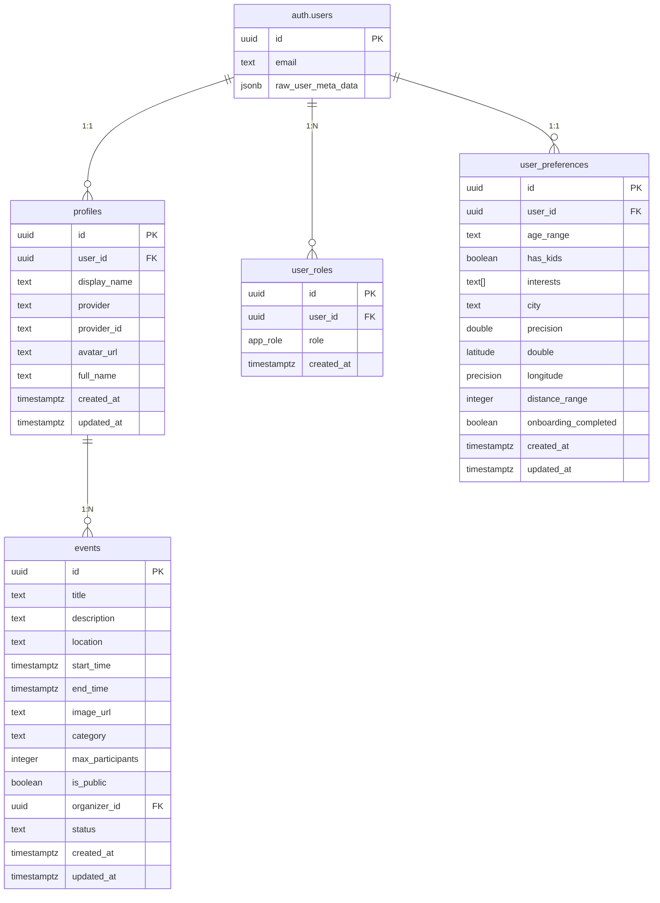

# Supabase Migration Analysis

## Overview
This document analyzes the Supabase migration scripts and provides a comprehensive compiled migration for the EventRadius application.

## Migration Files Analysis

### Core Migration Files (in order)

1. **0_events_table.sql** (1,726 bytes)
   - Creates the main `events` table
   - Sets up RLS policies for events
   - Adds performance indexes
   - Includes status management

2. **1_profiles.sql** (903 bytes)
   - Creates user `profiles` table
   - Basic user information storage
   - RLS policies for profile access

3. **2_user_roles.sql** (1,311 bytes)
   - Implements role-based access control (RBAC)
   - Creates `app_role` enum: 'admin', 'user', 'organizer'
   - Sets up `user_roles` junction table
   - Security definer function for role checking

4. **3_user_triggers.sql** (1,182 bytes)
   - Automatic timestamp updates
   - User signup handler trigger
   - Creates profile and assigns roles on signup

5. **4_user_preferences.sql** (2,079 bytes)
   - User onboarding preferences
   - Location-based preferences
   - Interest tracking
   - Enhanced signup trigger with preferences

6. **5_oauth_fields.sql** (944 bytes)
   - OAuth provider support
   - Avatar and full name fields
   - Provider identification

### Debug/Utility Files

- **comprehensive_debug.sql** (2,476 bytes) - Database debugging utilities
- **disable_all_constraints.sql** (2,534 bytes) - Constraint management
- **drop_triggers_debug.sql** (1,487 bytes) - Trigger management
- **fix_existing_users.sql** (694 bytes) - User data fixes
- **fix_user_preferences_rls.sql** (860 bytes) - RLS policy fixes
- **restore_signup_trigger.sql** (1,927 bytes) - Trigger restoration
- **restore_signup_trigger_safe.sql** (2,310 bytes) - Safe trigger restoration

## Database Architecture

### Tables Structure

### Security Model

#### Row Level Security (RLS) Policies

1. **Profiles**
   - Everyone can view profiles
   - Users can only update their own profile
   - Users can only insert their own profile

2. **User Roles**
   - Users can view their own roles
   - Only admins can manage roles

3. **Events**
   - Everyone can view public events
   - Users can create events (as organizer)
   - Organizers can update/delete their own events

4. **User Preferences**
   - Users can view/update their own preferences
   - Admins can view all preferences

#### Role-Based Access Control (RBAC)

- **admin**: Full system access
- **organizer**: Can create and manage events
- **user**: Standard user with preferences

### Key Features

#### 1. Automatic User Onboarding
- Trigger automatically creates profile on user signup
- Assigns default role based on metadata
- Creates user preferences for regular users
- Supports OAuth provider integration

#### 2. OAuth Provider Support
- Multiple authentication providers (email, Google, GitHub, etc.)
- Provider-specific user data (avatar, full name)
- Unique provider identification

#### 3. Event Management
- Comprehensive event data structure
- Status tracking (pending, approved, rejected, cancelled)
- Organizer-based access control
- Public/private event distinction

#### 4. User Preferences
- Location-based preferences with coordinates
- Interest tracking with array storage
- Age range and family-friendly options
- Distance range preferences

#### 5. Performance Optimization
- Strategic indexes on foreign keys and search fields
- Composite indexes for common queries
- RLS policy optimization

## Migration Dependencies

### Execution Order
1. Types and Enums
2. Core Tables
3. Functions and Triggers
4. RLS Policies
5. Indexes
6. Data Migration (if needed)

### Critical Dependencies
- `user_roles` depends on `app_role` enum
- `handle_new_user` trigger depends on all tables
- RLS policies depend on `has_role` function
- Indexes depend on table structure

## Migration Strategy

### For New Database
Run the `comprehensive_migration.sql` script in Supabase SQL Editor.

### For Existing Database
1. Run individual migration files in order
2. Handle existing data conflicts
3. Update existing user records
4. Verify trigger functionality

### Rollback Strategy
- Debug scripts available for constraint management
- Individual file structure allows selective rollback
- Backup procedures included in debug scripts

## Validation Checklist

### Post-Migration Verification
- [ ] All tables created with correct structure
- [ ] RLS enabled on all tables
- [ ] Triggers functioning correctly
- [ ] Indexes created properly
- [ ] Sample data operations work
- [ ] Role-based access functioning
- [ ] OAuth fields populated correctly

### Performance Validation
- [ ] Query execution times acceptable
- [ ] Index usage statistics
- [ ] RLS policy performance
- [ ] Trigger overhead minimal

## Maintenance Considerations

### Regular Tasks
- Monitor trigger performance
- Update RLS policies as needed
- Add new indexes based on query patterns
- Clean up orphaned records

### Scaling Considerations
- Partition large tables (events, user_preferences)
- Archive old event data
- Optimize RLS policies for high traffic
- Consider read replicas for analytics

## Security Notes

### Important Considerations
- All tables use RLS by default
- Admin role has elevated privileges
- OAuth tokens handled securely by Supabase
- User metadata validated before role assignment

### Best Practices
- Regular security audits of RLS policies
- Monitor admin role assignments
- Validate OAuth provider configurations
- Backup critical user data regularly

## Conclusion

The migration system provides a robust, secure, and scalable foundation for the EventRadius application. The comprehensive migration script combines all essential migrations while maintaining the modular structure for future updates.

The architecture supports:
- ✅ Multi-provider authentication
- ✅ Role-based access control
- ✅ Event management system
- ✅ User preferences and onboarding
- ✅ Performance optimization
- ✅ Security best practices
- ✅ Scalability considerations
